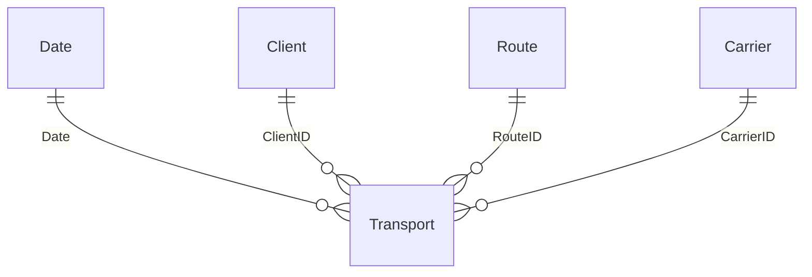

# Model gwiazdy

```mermaid
erDiagram
    Date ||--o{ Transport : "Date"
    Client ||--o{ Transport : "ClientID"
    Route ||--o{ Transport : "RouteID"
    Carrier ||--o{ Transport : "CarrierID"
```

Jedna zrealizowana wysyłka (ShipmentID). Filtry przepływają wyłącznie z wymiarów do faktów. Nie łączymy tabel faktów bezpośrednio. Scenario jest celowo odłączoną tabelą parametru.
